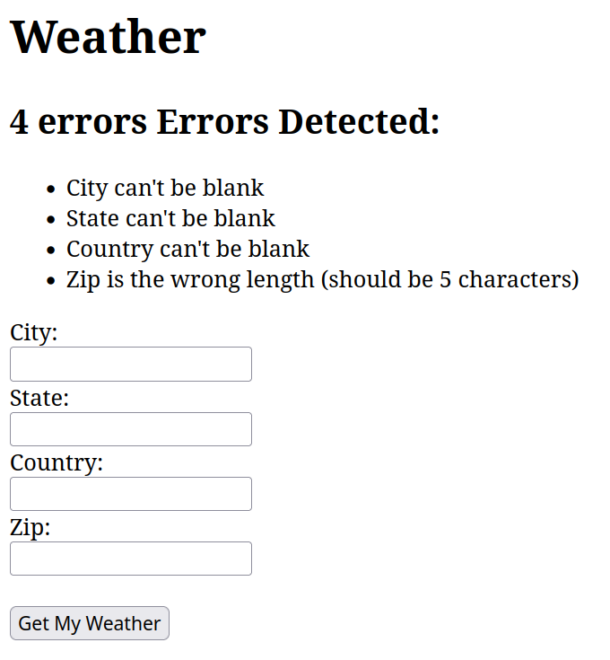

# Weather Forecast

Welcome to the Weather Forecast repository! This project is designed to provide users with up-to-date weather forecasts for various locations. Utilizing the OpenWeatherMap API, this application delivers accurate and current weather information to help you plan your day

## Features

    - Current Weather: Get the current temperature, humidity, wind speed, and weather conditions for your selected location.
    - Search by City: Easily search for weather forecasts by address
    - Data is cached for 30 minutes to reduce the number of API calls and improve performance.

## Screenshot 


## Getting Started

To get started with this project, follow these steps:
Prerequisites

Docker and docker-compose are required to run this application. If you do not have them installed, you can find installation instructions for your operating system below:

    - Install Docker Desktop for Windows or Mac.

## Installation of Weather Forecast

    Clone the repository:
       - git clone https://github.com/scottleeroberts/weather_forecast.git
       - docker-compose up --build

## Testing
Testing can be run with the following command:
```
docker compose run --rm --no-deps web /bin/bash -c "bundle exec rspec"
```


## Design Notes
- **DESIGN NOTES/CONSTRAITS/ASSUMPTIONS:** In the current implementation, the user is prompted to provide city, state, country, and zip code. However, only the zip code is utilized as a cache key, without directly influencing the latitude and longitude lookup for weather data. This approach presents a known limitation: the zip code is not employed in the lat/long retrieval process, yet it serves as the cache key. An alternative strategy would involve solely requesting the zip code from the user, leveraging it for both weather data retrieval and cache key purposes. Although this method might be less user-friendly, it would ensure consistency in the lookup and caching mechanisms. The existing solution represents a compromise, allowing users to input city, state, country, and zip code, but solely utilizing the zip code as the cache key. This is a recognized constraint of the current approach.

- **Framework:** The application is built entirely with Ruby on Rails, without any additional front-end frameworks. This approach was chosen to keep the application straightforward and easy to run.
- **User Interface:** The interface prompts users for their city, state, country, and zip code.
- **API Integration:** The OpenWeatherMap API is used to lookup lat/long for an address and also retrieve weather data. The API key is stored in an environment variable to maintain security.
- **Error Handling:** The application includes error handling for invalid input, such as a city/state/name/zip
- **Testing:** The application includes a suite of RSpec tests to ensure that the application is functioning as expected.
- **Dockerization:** The application is containerized using Docker, with a `docker-compose` file included in the repository. It is designed to run on port 3000 inside the container, and the `docker-compose` file maps this to port 3000 on the host machine.
- **Security:** NOTE: the .key file has been includd in in the repository for the purpose of this exercise. In a production environment, this file would be stored in a secure location and not included in the repository.


Contributing

Contributions are welcome! If you have any ideas for improvements or bug fixes, feel free to fork this repository, make your changes, and submit a pull request.
License

This project is licensed under the MIT License - see the LICENSE file for details.
